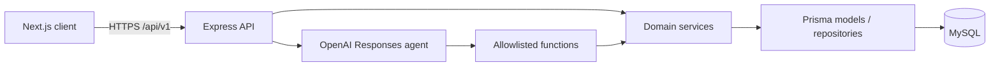

# CampusOS architecture

## Goals

CampusOS uses a modular monorepo so hackathon iteration remains fast without coupling UI, transport, business rules, persistence, and AI orchestration. Each workspace can be built and deployed independently.

## System context

## Backend dependency rule

Every feature in `backend/modules` exposes five responsibilities:

1. `*.routes.ts` defines URL and middleware composition.
2. `*.validation.ts` parses untrusted request input.
3. `*.controller.ts` translates HTTP into service calls and responses.
4. `*.service.ts` owns business rules and orchestration.
5. `*.model.ts` owns Prisma queries and persistence mapping.

Controllers never import Prisma. Services can combine models but remain unaware of Express. Models contain no HTTP behavior.

Shared infrastructure is intentionally small:

- `config/` validates environment variables and owns the Prisma singleton.
- `middleware/` handles cross-cutting HTTP concerns.
- `utils/` contains transport-independent errors, dates, and response helpers.
- `ai/` defines the model prompt, tool allowlist, execution loop, and bounded conversation memory.

## Frontend dependency rule

`app/` composes routes. `features/` owns interactive workflows and state. `components/` renders typed props. `services/api.ts` is the only browser HTTP client. `types/` and `utils/` are reusable leaf modules.

The dashboard is client-rendered because it is an authenticated, frequently refreshed operational surface. A future identity integration can move initial data loading to server components without changing component contracts.

## Deployment

The local environment runs MySQL in Docker while Node processes run on the host. A production deployment should use:

- a managed MySQL service with TLS, backups, and restricted credentials;
- separate frontend and backend deployments;
- a reverse proxy or API gateway for HTTPS and rate limiting;
- managed session/authentication middleware in place of `x-user-id`;
- centralized logs and traces keyed by `x-request-id`.

## Architectural guardrails

- API versioning begins at `/api/v1`.
- All mutations are validated before reaching controllers.
- Multi-record writes use Prisma transactions.
- OpenAI receives only service results required for the current question.
- AI session persistence is accessed through an internal service/model boundary and is bounded to 12 messages.
- Environment secrets are loaded server-side and excluded from Git.
