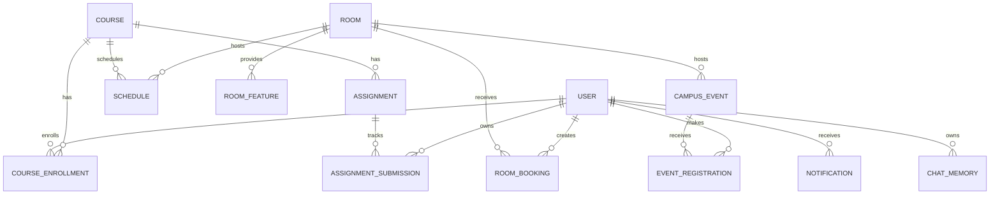

# Database design

## Source of truth

`database/schema.prisma` is the canonical schema. `database/migrations` contains deployable history; `database/seed` contains deterministic demo fixtures. Application code must not create tables at runtime.

## Entity model

Announcements are independent campus-wide records.

## Normalization decisions

- Courses are stored once and referenced by schedules, assignments, and enrollments.
- Room equipment is a `RoomFeature` relation rather than a JSON column, enabling indexed feature filters.
- Event registration counts are derived from registrations rather than stored twice.
- Assignment status is per student in `AssignmentSubmission`, not a global assignment field.
- Room bookings store exact start/end timestamps; recurring schedules store day-of-week plus MySQL `TIME` values.
- Notifications reference their source type/id without coupling all domain tables to delivery state.
- Chat memory is scoped to both session and user and bounded by the memory service.

## Indexes

Indexes target the platform’s primary reads:

- `schedules(day_of_week, start_time)` for daily timetables;
- `schedules(room_id, day_of_week, start_time, end_time)` for class conflicts;
- `room_bookings(room_id, starts_at, ends_at)` for availability;
- `campus_events(starts_at, status)` for upcoming events;
- `assignments(course_id, due_at)` and `assignments(due_at)` for deadlines;
- `announcements(priority, published_at)` and `announcements(expires_at)` for active notices;
- `assignment_submissions(user_id, status)` for student work queues.
- `notifications(user_id, status, send_at)` for unread/due delivery queries;
- `chat_memory(session_id, created_at)` for bounded conversation retrieval.

## Migration workflow

During development, edit `database/schema.prisma`, then run `npm run db:migrate` and commit the generated migration. In CI/production, use `npm run db:deploy --workspace backend`; never use `db push` against production.

The seed command intentionally clears domain tables before recreating demo data. Run it only in disposable development or evaluation databases.
